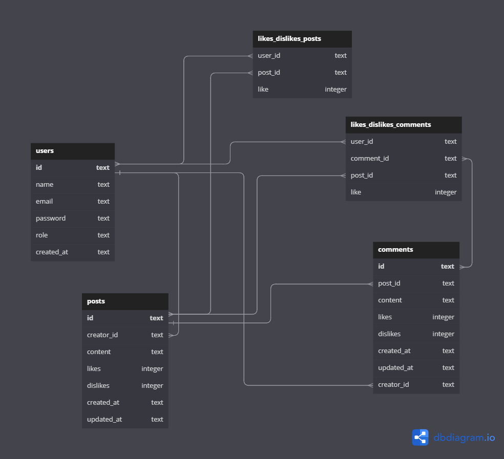

# Labeddit Back End

## Índice

* [Introdução](#introdução)
* [Repositorio do Front End](#repositório-front-end)
* [Tecnologias utilizadas](#tecnologias-utilizadas)
* [Aplicações utilizadas](#aplicações-utilizadas)
* [Funcionabilidades do Projeto](#funcionabilidades-do-projeto)
* [Banco de Dados](#banco-de-dados)
* [Documentação](#documentação)
* [Rodando o projeto](#rodando-o-projeto)

## Introdução
- Projeto do back end de uma rede social.

## Repositório Front End
- Repositório do front end do Labeddit: 
https://github.com/paulajardimf/labeddit-frontend

## Tecnologias utilizadas

1. ``Node.js``
2. ``Typescript.js``
3. ``Knex``
4. ``Express``
5. ``SQLite``
6. ``POO``
7. ``Arquitetura em camadas``
8. ``Geração de UUID``
9. ``Geração de hashes``
10. ``Autenticação e autorização``
11. ``Roteamento``
12. ``Jest``

## Aplicações utilizadas
- Postman
- Render

## Funcionabilidades do Projeto

- [x] Signup:
- id;
- name;
- email;
- password;
- role.

- [x] Login:
- email;
- password.
 

- [x] Create Post:
- id;
- content;
- likes;
- dislikes;
- createdAt;
- updatedAt;
- creator {
  id;
  name.
}
 

- [x] Like or Dislike Post:
 

- [x] Create Comment:
- id;
- postId;
- content;
- likes;
- dislikes;
- createdAt;
- updatedAt;
- creatorId;
- creatorName.
 

- [x] Like or Dislike Comment:
 

## Banco de Dados

 
## Documentação
https://documenter.getpostman.com/view/24460767/2s93JzMgNf

## Rodando o projeto
- Rode o console na pasta em que você baixou os arquivos;

- Insira o comando ``npm install``;

- Depois, o comando ``npm run dev`` para rodar na porta 3003.
